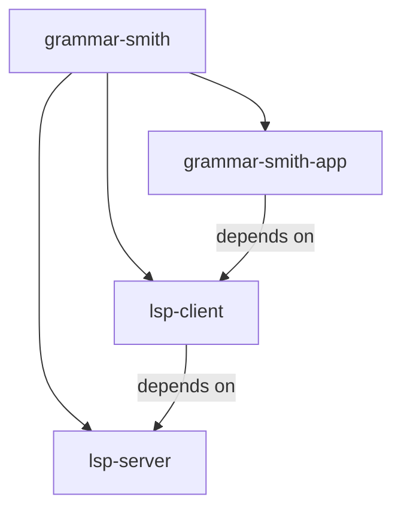
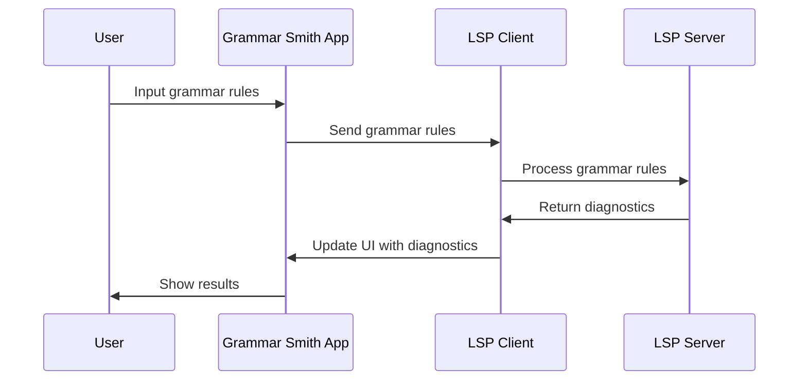
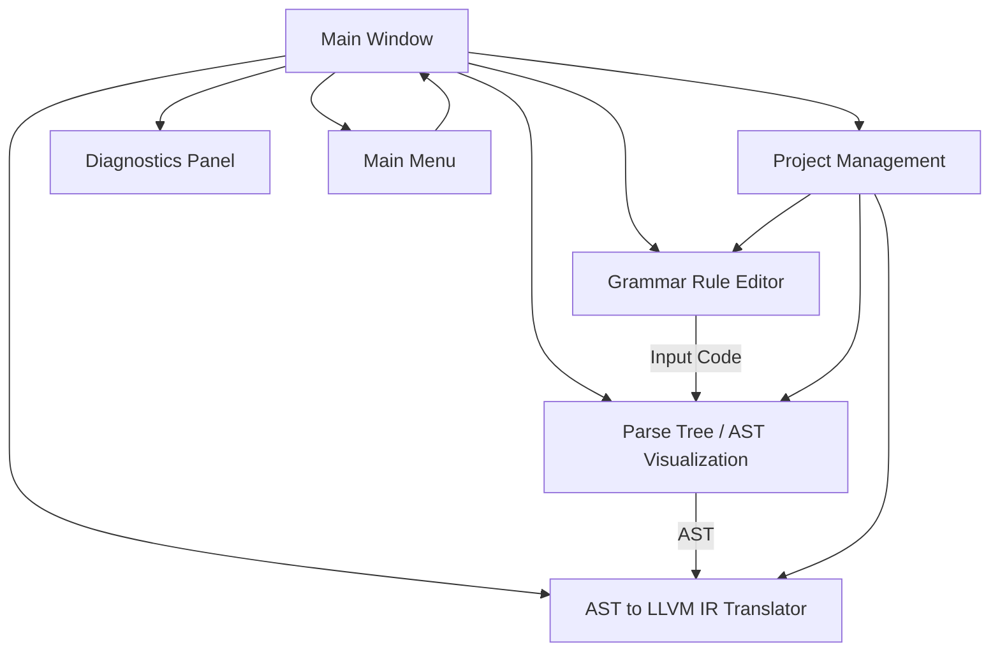

# grammar-smith
An IDE for building programming languages inspired by ANTLRWorks IDE

This project is a Java-based GUI application designed to guide users through the process of building a new programming language. The application will feature a grammar rule editor, parse tree visualization, AST editing, and AST-to-LLVM conversion. The application's main objective is to provide a modular, Git-compatible environment for language development, while supporting syntax highlighting, error checking, and diagnostic features. It uses **ANTLR** for parsing and **LLVM** for code generation, linked via an **LSP-based architecture** for learning purposes.

## Features
- **Grammar Rule Editor**: Create and edit grammar rules with syntax highlighting and error checking.
- **Parse Tree Visualization**: Visualize the parse tree generated from user input.
- **AST Management**: View and modify Abstract Syntax Trees (AST).
- **AST to LLVM IR Conversion**: Convert AST to LLVM Intermediate Representation (IR) for code generation.
- **LSP Architecture**: Leverage a Language Server Protocol (LSP) for communication between components, enabling syntax analysis, diagnostics, and more.
- **Git-Compatible Outputs**: All outputs (grammar, AST, LLVM) are saved as textual data for easy version control.

## Architecture

The project is organized into a **multi-module Maven** structure with the following modules:

- **lsp-server**: The Language Server, which handles requests for syntax highlighting, parsing, diagnostics, etc.
- **lsp-client**: The LSP client that interacts with the server and forwards requests from the UI.
- **grammar-smith-app**: The JavaFX-based GUI that provides the visual and interactive interface for users.

### Key Components

1. **Grammar Rule Editor**:
   - Syntax highlighting and diagnostics using LSP.
   - Based on **RichTextFX** for rich text display.
   - Allows users to create and edit language grammar rules interactively.

2. **Parse Tree & AST Visualization**:
   - Parse trees and ASTs are visualized using **JGraphX**.
   - Offers the ability to generate and explore language constructs step by step.

3. **AST to LLVM Conversion**:
   - Convert the generated AST into LLVM IR using **LLVM bindings**.
   - Visualize and edit the LLVM IR for low-level code generation.

### LSP-Based Solution

To maximize learning and modularity, the application follows an **LSP-based** architecture. The **Language Server Protocol** handles:
- Syntax highlighting,
- Error checking,
- AST generation,
- Diagnostics reporting.

Each UI action (e.g., grammar editing, code input) communicates with the LSP client, which forwards requests to the LSP server. The server responds asynchronously, allowing the application to update the UI based on the latest syntax analysis, parse trees, and diagnostics.

### Controllers

Each controller in the JavaFX application is responsible for managing specific parts of the communication between the UI and the LSP client:

1. **GrammarEditorController**: Manages the grammar editor, sending syntax highlighting and error checking requests.
2. **ParseTreeController**: Handles requests for parsing input and visualizing parse trees.
3. **DiagnosticsController**: Manages diagnostics such as syntax errors and warnings, and updates the UI accordingly.
4. **ASTController**: Oversees AST generation and conversion to LLVM IR.

### Testing

Unit tests are implemented using **JUnit5** and **Mockito** to mock dependencies such as the `LSPClient` and models. The tests cover:
- Syntax highlighting and error checking in the **GrammarEditorController**.
- Parse tree generation in the **ParseTreeController**.
- Diagnostic management in the **DiagnosticsController**.
- AST generation and LLVM conversion in the **ASTController**.

## Getting Started

###Prerequisites

- Java 21 or higher
- Maven for building the project
- JavaFX libraries for the GUI
- ANTLR for grammar parsing
- LLVM for IR generation

### Installation

Clone the repository:
git clone https://github.com/talaatharb/grammar-smith.git

Navigate to the project directory:
cd grammar-smith

Build the project using Maven:
mvn clean compile package

Running the Application
To run the JavaFX application, navigate to the grammar-smith-app module and execute:
mvn javafx:run

## Future Work

- Code Completion: Implement LSP-based code completion features.
- Enhanced Visualizations: Improve parse tree and AST visualizations with interactive features.
- Custom AST Manipulations: Allow users to modify ASTs and observe the effects in real time.
- Support for More Backends: Expand code generation beyond LLVM.

## Contributing

Contributions are welcome! Feel free to open issues or submit pull requests.

## License
This project is licensed under the Apache 2.0 License
